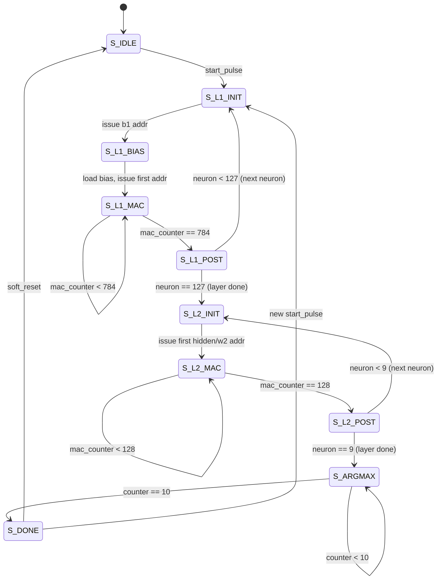

# MNIST TinyML SoC — Handwritten Digit Recognition on FPGA

> **SoC tích hợp TinyML Accelerator** nhận dạng chữ số viết tay MNIST bằng mạng MLP (Multi-Layer Perceptron) trên **Terasic DE10-Standard** (Intel Cyclone V 5CSXFC6D6F31C6).

---

## 📑 Mục lục

1. [Tổng quan dự án](#1-tổng-quan-dự-án)
2. [Thông số kỹ thuật](#2-thông-số-kỹ-thuật)
3. [Kiến trúc hệ thống SoC](#3-kiến-trúc-hệ-thống-soc)
4. [Kiến trúc MLP Accelerator (phần cứng)](#4-kiến-trúc-mlp-accelerator-phần-cứng)
5. [Quy trình Training & Quantization](#5-quy-trình-training--quantization)
6. [Register Map (Bản đồ thanh ghi)](#6-register-map-bản-đồ-thanh-ghi)
7. [Luồng dữ liệu End-to-End (từ Run đến kết quả)](#7-luồng-dữ-liệu-end-to-end-từ-run-đến-kết-quả)
8. [Finite State Machine (FSM)](#8-finite-state-machine-fsm)
9. [Cấu trúc thư mục dự án](#9-cấu-trúc-thư-mục-dự-án)
10. [Hiệu năng](#10-hiệu-năng)
11. [Memory Map (Bản đồ bộ nhớ)](#11-memory-map-bản-đồ-bộ-nhớ)
12. [Board I/O & Hiển thị](#12-board-io--hiển-thị)
13. [Hướng dẫn Build & Deploy](#13-hướng-dẫn-build--deploy)
14. [Simulation & Verification](#14-simulation--verification)
15. [Các giới hạn & Hướng phát triển](#15-các-giới-hạn--hướng-phát-triển)

---

## 1. Tổng quan dự án

Dự án xây dựng một **SoC hoàn chỉnh** trên FPGA để thực hiện nhận dạng chữ số viết tay (0–9) từ bộ dữ liệu MNIST, sử dụng kiến trúc mạng nơ-ron MLP đã được quantize xuống **INT8**. Toàn bộ quá trình inference (suy luận) được thực hiện **hoàn toàn bằng phần cứng** trên FPGA, với Nios II soft-processor đóng vai trò điều khiển (nạp dữ liệu ảnh, kích hoạt inference, đọc kết quả).

### Các đặc điểm chính

| Đặc điểm | Chi tiết |
|---|---|
| **Mô hình AI** | MLP 784 → 128 → 10 (2 lớp fully-connected) |
| **Board FPGA** | Terasic DE10-Standard |
| **FPGA** | Intel Cyclone V 5CSXFC6D6F31C6 |
| **Quantization** | INT8 weights, INT32 accumulator |
| **Activation** | Leaky ReLU (α = 0.125) |
| **Soft-processor** | Nios II Gen2 (Tiny variant) |
| **Bus giao tiếp** | Avalon-MM (Avalon Memory-Mapped) |
| **Tần số hoạt động** | 50 MHz |
| **Thời gian inference** | ~102,000 clock cycles (~2.04 ms @ 50 MHz) |
| **Hiển thị kết quả** | HEX0 (7-segment) — trực tiếp từ phần cứng |
| **Toolchain** | Quartus Prime 18.1 Lite Edition |

---

## 2. Thông số kỹ thuật

### 2.1. FPGA Target

| Thông số | Giá trị |
|---|---|
| Device | 5CSXFC6D6F31C6 |
| Family | Cyclone V SoC |
| Package | FBGA-896 |
| Speed Grade | 6 (slowest) |
| Logic Elements (ALMs) | 41,910 |
| M10K Memory Blocks | 553 (5,662 Kbit) |
| DSP Blocks (18×18) | 112 |
| Nhiệt độ hoạt động | 0°C – 85°C (Commercial) |

### 2.2. Mô hình MLP

| Thông số | Giá trị |
|---|---|
| Input size | 784 (ảnh 28×28 pixels, grayscale) |
| Hidden layer size | 128 neurons |
| Output layer size | 10 neurons (digits 0–9) |
| Hidden activation | Leaky ReLU (α = 1/8 = 0.125) |
| Output activation | Không (raw logit score → argmax) |
| Tổng tham số | 784×128 + 128 (bias) + 128×10 = **101,890** |
| Định dạng weight | Signed INT8 (8-bit) |
| Định dạng bias | Signed INT32 (32-bit, chỉ hidden layer) |
| Định dạng accumulator | Signed INT32 (32-bit) |

### 2.3. Quantization Parameters

| Thông số | Giá trị | Mô tả |
|---|---|---|
| `L1_REQUANT_MULT` | 12 | Hệ số nhân fixed-point cho requantization |
| `L1_REQUANT_SHIFT` | 15 | Số bit dịch phải (chia 2^15 = 32768) |
| `LEAKY_SHIFT` | 3 | Leaky ReLU: α = 1/2³ = 0.125 |
| Input range | [0, 127] | Pixel đã quantize từ [0, 255] → [0, 127] |
| Hidden output range | [-127, 127] | Clamp sau requantization |

---

## 3. Kiến trúc hệ thống SoC

### 3.1. Block Diagram tổng quan

```
┌────────────────────────────────────────────────────────────────────────┐
│                        DE10-Standard Board                             │
│                                                                        │
│   CLOCK_50 (50 MHz)                                                    │
│       │                                                                │
│       ▼                                                                │
│   ┌──────────────────── Platform Designer (Qsys) System ────────────┐  │
│   │                                                                 │  │
│   │  ┌──────────────┐    Avalon-MM Bus (Interconnect)               │  │
│   │  │ Nios II Gen2 │◄════════════════════════════════════╗         │  │
│   │  │ (Tiny, 50MHz)│    ║           ║         ║          ║         │  │
│   │  └──────┬───────┘    ║           ║         ║          ║         │  │
│   │         │ IRQ        ║           ║         ║          ║         │  │
│   │         │            ║           ║         ║          ║         │  │
│   │  ┌──────▼────────┐   ║    ┌──────▼─────┐   ║   ┌──────▼─────┐   │  │
│   │  │ MLP Accel.    │◄══╝    │ On-Chip RAM│   ║   │ JTAG UART  │   │  │
│   │  │ (Custom IP)   │        │ (32 KB)    │   ║   │            │   │  │
│   │  │ 784→128→10    │        └────────────┘   ║   └────────────┘   │  │
│   │  └──┬────┬───────┘                         ║                    │  │
│   │     │    │                          ┌──────▼─────┐              │  │
│   │     │    │ conduit                  │ LED PIO    │──► LEDR[9:0] │  │
│   │     │    │ (direct HW)              │ (10-bit)   │              │  │
│   │     │    │                          └────────────┘              │  │
│   │     │    │                          ┌────────────┐              │  │
│   │     │    │                          │ Timer      │              │  │
│   │     │    │                          │ (32-bit)   │              │  │
│   │     │    │                          └────────────┘              │  │
│   └─────┼────┼──────────────────────────────────────────────────────┘  │
│         │    │                                                         │
│         │    ▼ result_digit[3:0]                                       │
│         │   ┌──────────────┐                                           │
│         │   │ HEX Decoder  │──► HEX0 (7-segment display)               │
│         │   └──────────────┘                                           │
│         │                                                              │
│         ▼ result_valid                                                 │
│        LEDR[0] (inference done LED)                                    │
│                                                                        │
│   KEY[0] = System Reset (active-low)                                   │
└────────────────────────────────────────────────────────────────────────┘
```

### 3.2. Thành phần trong Platform Designer (Qsys)

| Component | Instance Name | Loại | Mô tả |
|---|---|---|---|
| Clock Source | `clk_0` | Intel IP | 50 MHz clock + reset |
| Nios II Gen2 | `nios2_gen2_0` | Intel IP | Soft processor (Tiny variant) |
| On-Chip Memory | `onchip_memory2_0` | Intel IP | 32 KB SRAM (code + data) |
| JTAG UART | `jtag_uart_0` | Intel IP | UART qua JTAG (debug console) |
| Timer | `timer_0` | Intel IP | 32-bit timer (1 ms period) |
| LED PIO | `led` | Intel IP | 10-bit output PIO → LEDR |
| **MLP Accelerator** | `mlp_acc` | **Custom IP** | TinyML inference engine |

---

## 4. Kiến trúc MLP Accelerator (phần cứng)

### 4.1. Tổng quan module

MLP Accelerator là **Custom IP** được thiết kế bằng Verilog, tích hợp vào Platform Designer qua file `MLP_Accelerator_hw.tcl`. Nó thực hiện toàn bộ pipeline inference MLP trong phần cứng:

```
                          Avalon-MM Slave Interface
                                    │
                    ┌───────────────┼───────────────┐
                    │               │               │
                    ▼               ▼               ▼
            ┌──────────┐   ┌──────────────┐  ┌──────────┐
            │  Control │   │ Input Buffer │  │  Status  │
            │ Register │   │ (784×8-bit)  │  │ Register │
            │ CTRL/RST │   │   M10K BRAM  │  │BUSY/DONE │
            └────┬─────┘   └──────┬───────┘  └────┬─────┘
                 │                │               │
                 ▼                ▼               │
            ┌────────────────────────────────┐    │
            │       Main FSM Controller      │    │
            │  (10 states, sequential MAC)   │◄───┘
            └──┬──────┬──────┬──────┬────────┘
               │      │      │      │
          ┌────▼──┐ ┌─▼────┐ ▼    ┌─▼─────────┐
          │  W1   │ │  W2  │ │    │    B1     │
          │  ROM  │ │  ROM │ │    │    ROM    │
          │100352 │ │ 1280 │ │    │  128×32b  │
          │ ×8bit │ │ ×8bit│ │    │  (bias)   │
          │ M10K  │ │ M10K │ │    │  M10K     │
          └───┬───┘ └──┬───┘ │    └────┬──────┘
              │        │     │         │
              ▼        ▼     ▼         ▼
            ┌─────────────────────────────┐
            │       MAC Unit (1x)         │
            │  INT8 × INT8 → INT32 acc    │
            │  (Cyclone V DSP 18×18)      │
            └──────────┬──────────────────┘
                       │
                       ▼
            ┌─────────────────────────────┐
            │  Requantization + Leaky ReLU│
            │  acc × 12 >> 15             │
            │  clamp [-127, 127]          │
            │  x≥0 ? x : x>>>3            │
            └──────────┬──────────────────┘
                       │
                       ▼
            ┌─────────────────────────────┐
            │    Hidden Buffer (128×8b)   │
            └──────────┬──────────────────┘
                       │ (Layer 2 MAC)
                       ▼
            ┌─────────────────────────────┐
            │  Output Registers (10×32b)  │
            └──────────┬──────────────────┘
                       │
                       ▼
            ┌─────────────────────────────┐
            │        Argmax Logic         │
            │  → result_digit [3:0]       │
            │  → max_score [31:0]         │
            └─────────────────────────────┘
```

### 4.2. Danh sách file Verilog

| File | Dòng code | Mô tả |
|---|---|---|
| `mlp_accelerator.v` | 519 | Module chính: FSM, Avalon-MM interface, datapath |
| `mac_unit.v` | 40 | Multiply-Accumulate unit (INT8×INT8, INT32 acc) |
| `weight_rom.v` | 36 | ROM tham số, inferred M10K BRAM, `$readmemh` |
| `hex_decoder.v` | 42 | BCD → 7-segment decoder (active-low) |
| `mnist_soc_top.v` | 96 | Top-level: kết nối Qsys ↔ Board pin |
| `tb_mlp_accelerator.v` | 208 | Testbench simulation |
| `MLP_Accelerator_hw.tcl` | 255 | Platform Designer component definition |

### 4.3. MAC Unit

MAC Unit thực hiện phép nhân-tích lũy cho mỗi neuron:

```
acc = acc + (a × b)
```

- **Input `a`**: Activation (INT8) — pixel hoặc hidden neuron output
- **Input `b`**: Weight (INT8) — từ W1 hoặc W2 ROM
- **Output `acc`**: Accumulator (INT32)
- **Tính chất**:
  - Sử dụng 1 DSP block 18×18 của Cyclone V
  - INT8 × INT8 = INT16 (signed), sign-extend lên INT32 rồi cộng tích lũy
  - Hỗ trợ: `clear` (xóa acc), `load_en` (nạp bias), `mac_en` (MAC)
  - Thứ tự ưu tiên: clear > load > enable
  - Throughput: **1 MAC/clock cycle** (pipelined)

### 4.4. Weight ROM

- ROM parameter được infer thành **M10K Block RAM** trên Cyclone V
- Khởi tạo từ Intel HEX file bằng `$readmemh()`
- Read latency: **1 clock cycle** (registered output)
- 3 ROM instances:

| ROM | Kích thước | Data Width | Addr Width | HEX File |
|---|---|---|---|---|
| W1 (hidden weights) | 100,352 entries | 8-bit | 17-bit | `w1_int8.hex` |
| W2 (output weights) | 1,280 entries | 8-bit | 11-bit | `w2_int8.hex` |
| B1 (hidden biases) | 128 entries | 32-bit | 7-bit | `b1_int32.hex` |

### 4.5. Requantization & Leaky ReLU

Sau khi MAC xong cho 1 hidden neuron (Layer 1), kết quả INT32 được xử lý:

```
1. Requantization:
   requant_product = mac_acc × L1_REQUANT_MULT (= 12)
   requant_shifted = requant_product >>> L1_REQUANT_SHIFT (= 15)
   requant_clamped = clamp(requant_shifted, -127, +127)

2. Leaky ReLU:
   output = (requant_clamped >= 0) ? requant_clamped : (requant_clamped >>> 3)
   // α = 1/2³ = 0.125
```

Toàn bộ logic này là **combinational** (không mất thêm clock cycle).

---

## 5. Quy trình Training & Quantization

### 5.1. Training Pipeline

Toàn bộ quy trình training được thực hiện trong notebook:
`Training/mnist_mlp_training_and_export.ipynb`

```
MNIST Dataset (CSV)
     │
     ▼
┌──────────────────────┐
│  PyTorch Training    │
│  MLP: 784→128→10     │
│  Leaky ReLU (α=0.125)│
│  Float32 weights     │
└──────────┬───────────┘
           │
           ▼
┌─────────────────────┐
│  Post-Training      │
│  INT8 Quantization  │
│  Scale + Zero-point │
└──────────┬──────────┘
           │
           ├─► w1_int8.hex  (784×128 = 100,352 values, INT8)
           ├─► w2_int8.hex  (128×10  = 1,280 values, INT8)
           ├─► b1_int32.hex (128 values, INT32)
           └─► Requantization params: MULT=12, SHIFT=15
```

### 5.2. Quantization chi tiết

1. **Input quantization**: Pixel gốc [0, 255] → scale xuống [0, 127] (signed INT8 range)
2. **Weight quantization**: Float32 → INT8 bằng symmetric quantization per-tensor
3. **Bias quantization**: Float32 → INT32 (bias đã scale theo input_scale × weight_scale)
4. **Requantization**: Sau Layer 1 MAC (INT32) → scale lại về INT8 cho Layer 2
   - `output_int8 = clamp((acc × 12) >> 15, -127, 127)`
5. **Output layer**: Giữ nguyên INT32 raw score → argmax chọn digit lớn nhất

### 5.3. Dữ liệu training

| File | Kích thước | Mô tả |
|---|---|---|
| `Training/input/train.csv` | ~76 MB | 42,000 training samples |
| `Training/input/test.csv` | ~51 MB | 28,000 test samples |

---

## 6. Register Map (Bản đồ thanh ghi)

MLP Accelerator xuất ra Avalon-MM bus với **11-bit word address** (2048 words address space, tương đương 8 KB byte address space).

### 6.1. Control & Status Registers

| Word Addr | Byte Addr | Tên | R/W | Bit Fields | Mô tả |
|---|---|---|---|---|---|
| `0x000` | `0x0000` | **CTRL** | W | `[0]` START, `[1]` SOFT_RESET | Thanh ghi điều khiển |
| `0x001` | `0x0004` | **STATUS** | R | `[0]` BUSY, `[1]` DONE | Thanh ghi trạng thái |
| `0x002` | `0x0008` | **RESULT** | R | `[3:0]` digit | Chữ số dự đoán (0–9) |
| `0x003` | `0x000C` | **SCORE** | R | `[31:0]` signed | Điểm score cao nhất (INT32) |

### 6.2. Output Score Registers

| Word Addr | Byte Addr | Tên | R/W | Mô tả |
|---|---|---|---|---|
| `0x004` | `0x0010` | OUT[0] | R | Score cho digit 0 (INT32 signed) |
| `0x005` | `0x0014` | OUT[1] | R | Score cho digit 1 |
| `0x006` | `0x0018` | OUT[2] | R | Score cho digit 2 |
| `0x007` | `0x001C` | OUT[3] | R | Score cho digit 3 |
| `0x008` | `0x0020` | OUT[4] | R | Score cho digit 4 |
| `0x009` | `0x0024` | OUT[5] | R | Score cho digit 5 |
| `0x00A` | `0x0028` | OUT[6] | R | Score cho digit 6 |
| `0x00B` | `0x002C` | OUT[7] | R | Score cho digit 7 |
| `0x00C` | `0x0030` | OUT[8] | R | Score cho digit 8 |
| `0x00D` | `0x0034` | OUT[9] | R | Score cho digit 9 |

### 6.3. Input Buffer (Pixel Data)

| Word Addr | Byte Addr | Tên | R/W | Mô tả |
|---|---|---|---|---|
| `0x400` | `0x1000` | INPUT[0] | W | Pixel 0 (`[7:0]`, signed INT8) |
| `0x401` | `0x1004` | INPUT[1] | W | Pixel 1 |
| ... | ... | ... | W | ... |
| `0x70F` | `0x1C3C` | INPUT[783] | W | Pixel 783 |

> **Lưu ý**: Mỗi pixel chiếm 1 word (32-bit) trên bus Avalon-MM, nhưng chỉ `[7:0]` được sử dụng. Ghi pixel chỉ hoạt động khi accelerator **không bận** (BUSY = 0).

### 6.4. Sơ đồ bit CTRL Register

```
Bit  31                              2    1         0
     ┌──────────────────────────────┬────┬─────────┐
     │         Reserved (0)         │ SR │  START  │
     └──────────────────────────────┴────┴─────────┘
     
SR    = SOFT_RESET : Ghi 1 để reset FSM về IDLE
START = START      : Ghi 1 để bắt đầu inference (one-shot pulse)
```

### 6.5. Sơ đồ bit STATUS Register

```
Bit  31                              2     1        0
     ┌──────────────────────────────┬──────┬───────┐
     │         Reserved (0)         │ DONE │ BUSY  │
     └──────────────────────────────┴──────┴───────┘
     
BUSY = 1 : Đang inference
DONE = 1 : Inference hoàn tất, kết quả sẵn sàng
```

---

## 7. Luồng dữ liệu End-to-End (từ Run đến kết quả)

### 7.1. Toàn bộ flow (step-by-step)

Dưới đây mô tả **chính xác** những gì xảy ra bên trong DE10-Standard từ lúc nhấn **Run** trên Nios II Eclipse cho đến khi hiển thị kết quả:

```
╔══════════════════════════════════════════════════════════════════════════╗
║                    COMPLETE EXECUTION FLOW                               ║
╠══════════════════════════════════════════════════════════════════════════╣
║                                                                          ║
║  ┌─ PC (Nios II Eclipse) ─────────────────────────────────────────────┐  ║
║  │ 1. Nhấn "Run" → JTAG cable truyền firmware (.elf) qua USB-Blaster  │  ║
║  │    vào On-Chip Memory (32KB) trên FPGA                             │  ║
║  └───────────────────────────────┬────────────────────────────────────┘  ║
║                                  │                                       ║
║  ┌─ Nios II Processor ───────────▼───────────────────────────────────┐   ║
║  │ 2. CPU bắt đầu chạy main() từ On-Chip Memory                      │   ║
║  │                                                                   │   ║
║  │ 3. SOFT RESET: Ghi 0x02 vào CTRL register                         │   ║
║  │    CPU ──[Avalon-MM Write]──► MLP_BASE + 0x0000 = 0x02            │   ║
║  │    → FSM reset về IDLE, xóa BUSY/DONE flags                       │   ║
║  │                                                                   │   ║
║  │ 4. GHI 784 PIXELS: Vòng lặp for(i=0..783)                         │   ║
║  │    CPU ──[Avalon-MM Write]──► MLP_BASE + 0x1000 + i×4             │   ║
║  │    → Mỗi pixel (INT8) ghi vào input_buf[i] trong BRAM             │   ║
║  │    → 784 bus transactions × ~2 cycles = ~1,568 cycles             │   ║
║  │                                                                   │   ║
║  │ 5. START: Ghi 0x01 vào CTRL register                              │   ║
║  │    CPU ──[Avalon-MM Write]──► MLP_BASE + 0x0000 = 0x01            │   ║
║  │    → start_pulse = 1 trong 1 cycle → FSM chuyển IDLE → L1_INIT    │   ║
║  │    → BUSY = 1                                                     │   ║
║  └───────────────────────────────┬───────────────────────────────────┘   ║
║                                  │                                       ║
║  ┌─ MLP Accelerator Hardware ────▼─────────────────────────────────────┐ ║
║  │                                                                     │ ║
║  │  ╔══ LAYER 1: Hidden Layer (×128 neurons) ════════════════════════╗ │ ║
║  │  ║                                                                ║ │ ║
║  │  ║  Cho mỗi neuron j = 0..127:                                    ║ │ ║
║  │  ║                                                                ║ │ ║
║  │  ║  6a. S_L1_INIT (1 cycle):                                      ║ │ ║
║  │  ║      - MAC clear (acc = 0)                                     ║ │ ║
║  │  ║      - Issue b1_rom_addr = j                                   ║ │ ║
║  │  ║                                                                ║ │ ║
║  │  ║  6b. S_L1_BIAS (1 cycle):                                      ║ │ ║
║  │  ║      - b1_rom_data valid → load vào MAC acc                    ║ │ ║
║  │  ║      - acc = bias[j]                                           ║ │ ║
║  │  ║      - Issue input_buf[0] + w1_rom[j×784]                      ║ │ ║
║  │  ║                                                                ║ │ ║
║  │  ║  6c. S_L1_MAC (784 cycles):                                    ║ │ ║
║  │  ║      - Vòng lặp i = 0..783:                                    ║ │ ║
║  │  ║        acc += input_buf[i] × w1_rom[j×784 + i]                 ║ │ ║
║  │  ║      - Pipeline: addr cycle N → data cycle N+1 → MAC cycle N+1 ║ │ ║
║  │  ║                                                                ║ │ ║
║  │  ║  6d. S_L1_POST (1 cycle):                                      ║ │ ║
║  │  ║      - Requantize: result = clamp((acc × 12) >> 15, ±127)      ║ │ ║
║  │  ║      - Leaky ReLU: result≥0 ? result : result>>>3              ║ │ ║
║  │  ║      - Ghi hidden_buf[j] = result (INT8)                       ║ │ ║
║  │  ║                                                                ║ │ ║
║  │  ║  → Mỗi neuron: 1+1+784+1 = 787 cycles                          ║ │ ║
║  │  ║  → Tổng Layer 1: 128 × 787 = ~100,736 cycles                   ║ │ ║
║  │  ╚════════════════════════════════════════════════════════════════╝ │ ║
║  │                                                                     │ ║
║  │  ╔══ LAYER 2: Output Layer (×10 neurons) ═════════════════════╗     │ ║
║  │  ║                                                            ║     │ ║
║  │  ║  Cho mỗi output neuron k = 0..9:                           ║     │ ║
║  │  ║                                                            ║     │ ║
║  │  ║  7a. S_L2_INIT (1 cycle):                                  ║     │ ║
║  │  ║      - MAC clear (acc = 0)                                 ║     │ ║
║  │  ║      - Issue hidden_buf[0] + w2_rom[k×128]                 ║     │ ║
║  │  ║                                                            ║     │ ║
║  │  ║  7b. S_L2_MAC (128 cycles):                                ║     │ ║
║  │  ║      - Vòng lặp i = 0..127:                                ║     │ ║
║  │  ║        acc += hidden_buf[i] × w2_rom[k×128 + i]            ║     │ ║
║  │  ║                                                            ║     │ ║
║  │  ║  7c. S_L2_POST (1 cycle):                                  ║     │ ║
║  │  ║      - output_reg[k] = mac_acc (raw INT32, không quantize) ║     │ ║
║  │  ║                                                            ║     │ ║
║  │  ║  → Mỗi neuron: 1+128+1 = 130 cycles                        ║     │ ║
║  │  ║  → Tổng Layer 2: 10 × 130 = 1,300 cycles                   ║     │ ║
║  │  ╚════════════════════════════════════════════════════════════╝     │ ║
║  │                                                                     │ ║
║  │  ╔══ ARGMAX (11 cycles) ══════════════════════════════════════╗     │ ║
║  │  ║                                                            ║     │ ║
║  │  ║  8. So sánh tuần tự 10 output scores:                      ║     │ ║
║  │  ║     best_digit = argmax(output_reg[0..9])                  ║     │ ║
║  │  ║     best_score = max(output_reg[0..9])                     ║     │ ║
║  │  ║                                                            ║     │ ║
║  │  ╚════════════════════════════════════════════════════════════╝     │ ║
║  │                                                                     │ ║
║  │  9. S_DONE (1 cycle):                                               │ ║
║  │     - BUSY = 0, DONE = 1                                            │ ║
║  │     - result_reg = best_digit                                       │ ║
║  │     - IRQ asserted → Nios II nhận interrupt                         │ ║
║  │     - result_digit[3:0] → conduit → HEX decoder → HEX0              │ ║
║  │       (hiển thị TỰ ĐỘNG, không cần software)                        │ ║
║  └───────────────────────────────┬─────────────────────────────────────┘ ║
║                                  │                                       ║
║  ┌─ Nios II Processor (tiếp) ────▼──────────────────────────────────┐    ║
║  │                                                                  │    ║
║  │ 10. POLL STATUS: Vòng while(!DONE)                               │    ║
║  │     CPU ──[Avalon-MM Read]──► MLP_BASE + 0x0004                  │    ║
║  │     → Đọc STATUS register, kiểm tra bit DONE                     │    ║
║  │                                                                  │    ║
║  │ 11. ĐỌC KẾT QUẢ:                                                 │    ║
║  │     CPU ──[Avalon-MM Read]──► MLP_BASE + 0x0008 → RESULT (digit) │    ║
║  │     CPU ──[Avalon-MM Read]──► MLP_BASE + 0x000C → SCORE          │    ║
║  │     CPU ──[Avalon-MM Read]──► MLP_BASE + 0x0010..0x0034 → OUT[]  │    ║
║  │                                                                  │    ║
║  │ 12. IN RA CONSOLE:                                               │    ║
║  │     CPU ──[Avalon-MM Write]──► JTAG_UART_BASE                    │    ║
║  │     → Gửi text kết quả qua JTAG cable → hiển thị trên PC         │    ║
║  │                                                                  │    ║
║  │ 13. LEDR: Ghi (1 << digit) vào LED PIO → bật LED tương ứng       │    ║
║  └──────────────────────────────────────────────────────────────────┘    ║
║                                                                          ║
║  ┌─ Board Output ───────────────────────────────────────────────────┐    ║
║  │ • HEX0: Hiển thị digit dự đoán (direct từ hardware)              │    ║
║  │ • LEDR[0]: result_valid (inference done)                         │    ║
║  │ • LEDR[x]: LED tương ứng digit (từ software PIO)                 │    ║
║  │ • JTAG UART Console: In chi tiết scores + kết quả                │    ║
║  └──────────────────────────────────────────────────────────────────┘    ║
╚══════════════════════════════════════════════════════════════════════════╝
```

### 7.2. Đường đi dữ liệu tóm tắt

```
test_image.h (784 bytes, compile-time constant)
       │
       │  (CPU read from On-Chip Memory)
       ▼
  Nios II CPU
       │
       │  (Avalon-MM Write × 784, bus addr 0x1000..0x1C3C)
       ▼
  input_buf[784] (M10K BRAM in MLP Accelerator)
       │
       │  (FSM Layer 1: 128 neuron × 784 MAC each)
       ├──── × W1 ROM [100,352 × 8-bit] + B1 ROM [128 × 32-bit]
       │
       ▼
  MAC Unit (INT8 × INT8 → INT32 accumulate)
       │
       │  (Requantize + Leaky ReLU, combinational)
       ▼
  hidden_buf[128] (INT8, register array)
       │
       │  (FSM Layer 2: 10 neuron × 128 MAC each)
       ├──── × W2 ROM [1,280 × 8-bit]
       │
       ▼
  MAC Unit (INT8 × INT8 → INT32 accumulate)
       │
       ▼
  output_reg[10] (INT32, raw scores)
       │
       │  (Argmax, sequential compare × 10)
       ▼
  result_digit [3:0] ──────► HEX Decoder ──► HEX0 Display
  max_score [31:0]
       │
       │  (Avalon-MM Read by CPU)
       ▼
  Nios II CPU ──► JTAG UART ──► PC Console
```

---

## 8. Finite State Machine (FSM)

### 8.1. State Diagram



### 8.2. Mô tả chi tiết các State

| State | Encoding | Cycles | Mô tả |
|---|---|---|---|
| `S_IDLE` | 4'd0 | — | Chờ lệnh START, không hoạt động |
| `S_L1_INIT` | 4'd1 | 1 | Clear MAC, issue bias ROM address |
| `S_L1_BIAS` | 4'd2 | 1 | Load bias vào accumulator, issue first data addr |
| `S_L1_MAC` | 4'd3 | 784 | MAC loop: `acc += input[i] × W1[j×784+i]` |
| `S_L1_POST` | 4'd4 | 1 | Requantize + Leaky ReLU → ghi hidden_buf |
| `S_L2_INIT` | 4'd5 | 1 | Clear MAC, issue first hidden/W2 addr |
| `S_L2_MAC` | 4'd6 | 128 | MAC loop: `acc += hidden[i] × W2[k×128+i]` |
| `S_L2_POST` | 4'd7 | 1 | Lưu INT32 score vào output_reg |
| `S_ARGMAX` | 4'd8 | 11 | So sánh tuần tự tìm max score & digit |
| `S_DONE` | 4'd9 | 1 | Báo hoàn tất, set DONE=1, BUSY=0, assert IRQ |

---

## 9. Cấu trúc thư mục dự án

```
SoC-TinyML-Accelerator-MNIST-DE10-Standard-Cyclone-V/
├── TinyML/                           # RTL & FPGA build files
│   ├── mlp_accelerator.v             # ★ MLP Accelerator (main module)
│   ├── mac_unit.v                    # MAC Unit (INT8×INT8→INT32)
│   ├── weight_rom.v                  # Parameterized ROM (M10K BRAM)
│   ├── hex_decoder.v                 # 7-segment decoder
│   ├── mnist_soc_top.v               # Top-level (board pin connections)
│   ├── tb_mlp_accelerator.v          # Testbench
│   ├── MLP_Accelerator_hw.tcl        # Platform Designer component TCL
│   ├── w1_int8.hex                   # Weight Layer 1 (784×128, INT8)
│   ├── w2_int8.hex                   # Weight Layer 2 (128×10, INT8)
│   └── b1_int32.hex                  # Bias Layer 1 (128, INT32)
│   └── Software/TinyML/
│       ├── source.c                      # ★ Main firmware (driver + control)
│       └── test_image.h                  # Test image data (784 bytes, INT8)
│
├── MNIST/                                   # Model training
│   ├── mnist_mlp_training_and_export.ipynb  # ★ Training notebook
│   └── input/
│       ├── train.csv                        # MNIST training data (~76 MB) - Source: https://www.kaggle.com/competitions/digit-recognizer/data
│       └── test.csv                         # MNIST test data (~51 MB)     - Source: https://www.kaggle.com/competitions/digit-recognizer/data
│
└── README.md                                # ← File này
```

---

## 10. Hiệu năng

### 10.1. Cycle Count Analysis

| Giai đoạn | Công thức | Cycles |
|---|---|---|
| Layer 1 (1 neuron) | 1 (init) + 1 (bias) + 784 (MAC) + 1 (post) | 787 |
| Layer 1 (all) | 128 × 787 | **100,736** |
| Layer 2 (1 neuron) | 1 (init) + 128 (MAC) + 1 (post) | 130 |
| Layer 2 (all) | 10 × 130 | **1,300** |
| Argmax | 11 | **11** |
| Done | 1 | **1** |
| **Tổng inference** | | **~102,048** |

### 10.2. Timing

| Metric | Giá trị |
|---|---|
| Clock frequency | 50 MHz (20 ns period) |
| Inference cycles | ~102,048 |
| **Inference latency** | **~2.04 ms** |
| Throughput (sustained) | ~490 inferences/second |
| MAC operations | 784×128 + 128×10 = 101,632 MACs |
| MAC utilization | 101,632 / 102,048 ≈ **99.6%** |

### 10.3. So sánh hiệu năng

| Platform | Inference Time | Ghi chú |
|---|---|---|
| **MLP Accelerator (FPGA)** | **~2 ms** | Hardware, 50 MHz, 1 DSP |
| Nios II (pure software) | ~500+ ms | Estimated, no HW accel |
| STM32F4 (ARM Cortex-M4) | ~10-50 ms | TinyML inference |
| Raspberry Pi (Python) | ~5-10 ms | Full neural framework overhead |

### 10.4. Resource Utilization (Estimated)

| Resource | Used | Available | Utilization |
|---|---|---|---|
| ALMs | ~3,000–5,000 | 41,910 | ~7–12% |
| M10K Blocks | ~110–120 | 553 | ~20–22% |
| DSP 18×18 | 1 | 112 | ~1% |
| On-Chip Memory | 32 KB (Nios) + ~100 KB (weights) | 5,662 Kbit | ~19% |

> **Ghi chú**: Phần lớn M10K blocks dùng cho Weight ROM (W1: 100,352 × 8-bit ≈ 98 KB).

---

## 11. Memory Map (Bản đồ bộ nhớ)

### 11.1. Nios II Address Space

| Base Address | End Address | Size | Component | Mô tả |
|---|---|---|---|---|
| `0x00008000` | `0x0000FFFF` | 32 KB | On-Chip Memory | Nios II code + data |
| `0x00010000` | `0x00011FFF` | 8 KB | **MLP Accelerator** | Custom IP registers + input buffer |
| `0x00012800` | `0x00012FFF` | 2 KB | Nios II Debug | Debug memory slave |
| `0x00013000` | `0x0001301F` | 32 B | Timer | 32-bit timer |
| `0x00013020` | `0x0001302F` | 16 B | LED PIO | 10-bit LED output |
| `0x00013038` | `0x0001303F` | 8 B | JTAG UART | Debug console |

### 11.2. IRQ Assignment

| IRQ # | Component | Mô tả |
|---|---|---|
| 0 | MLP Accelerator | Inference complete |
| 1 | JTAG UART | TX/RX buffer threshold |
| 2 | Timer | Timer overflow |

---

## 12. Board I/O & Hiển thị

### 12.1. Input

| Pin | Chức năng |
|---|---|
| `KEY[0]` (PIN_AJ4) | System Reset (active-low, nhấn = reset) |
| `CLOCK_50` (PIN_AF14) | 50 MHz system clock |

### 12.2. Output

| Pin | Chức năng |
|---|---|
| `HEX0[6:0]` | Hiển thị digit dự đoán (0–9) — **trực tiếp từ hardware** |
| `HEX1–HEX5` | Tắt (all segments OFF) |
| `LEDR[0]` | `result_valid` — sáng khi inference hoàn tất |
| `LEDR[9:1]` | Điều khiển bởi software qua LED PIO |

### 12.3. Kết nối JTAG

- **USB-Blaster cable**: Kết nối PC ↔ DE10-Standard qua cổng JTAG
- Dùng cho:
  1. Programming FPGA (nạp file `.sof`)
  2. Download firmware Nios II (nạp file `.elf`)
  3. JTAG UART console (debug output)

### 12.4. 7-Segment Encoding (Active-Low)

```
     --a--
    |     |
    f     b
    |     |
     --g--
    |     |
    e     c
    |     |
     --d--

segments = {g, f, e, d, c, b, a}  (active-low: 0 = ON, 1 = OFF)

Digit 0: 1000000    Digit 5: 0010010
Digit 1: 1111001    Digit 6: 0000010
Digit 2: 0100100    Digit 7: 1111000
Digit 3: 0110000    Digit 8: 0000000
Digit 4: 0011001    Digit 9: 0010000
```

---

## 13. Hướng dẫn Build & Deploy

### 13.1. Yêu cầu phần mềm

| Tool | Version | Mô tả |
|---|---|---|
| Intel Quartus Prime | 18.1 Lite Edition | FPGA synthesis & implementation |
| Nios II EDS (Eclipse) | 18.1 | Firmware development |
| Platform Designer (Qsys) | 18.1 | SoC integration |
| ModelSim-Altera | 18.1 | RTL simulation |
| Python 3 + PyTorch | Any | Model training (offline) |

### 13.2. Quy trình build

```
Step 1: Training (chỉ chạy 1 lần, offline trên PC)
═══════════════════════════════════════════════════
  Chạy notebook: Training/mnist_mlp_training_and_export.ipynb
  → Tạo: w1_int8.hex, w2_int8.hex, b1_int32.hex
  → Copy HEX files vào Hardware/


Step 2: Hardware Build (Quartus Prime)
═══════════════════════════════════════
  1. Mở project: Hardware/moduleTop.qpf
  2. Platform Designer: Mở system.qsys → Generate HDL
  3. Quartus: Compile (Analysis → Synthesis → Fitter → Assembler)
  4. Program FPGA: Tools → Programmer → Hardware Setup → Start
     File: output_files/moduleTop.sof


Step 3: Software Build (Nios II Eclipse)
═════════════════════════════════════════
  1. Mở Nios II Eclipse (SBT)
  2. File → New → Nios II Application and BSP from Template
     - SOPC Information File: Hardware/system.sopcinfo
     - Template: Blank Project
  3. Copy source.c và test_image.h vào project
  4. BSP Settings: Small C Library (giảm code size)
  5. Build Project (Ctrl+B)


Step 4: Run
═══════════
  1. FPGA đã được program (Step 2)
  2. Run → Run As → Nios II Hardware
  3. Quan sát:
     - Eclipse Console: Kết quả inference chi tiết
     - HEX0: Số dự đoán (hiển thị tự động)
     - LEDR: LED inference done
```

### 13.3. Thay đổi ảnh test

Để test với ảnh khác, sửa file `Software/test_image.h`:
1. Chọn ảnh 28×28 grayscale từ bộ MNIST
2. Quantize: `pixel_int8 = pixel_uint8 / 2` (scale [0,255] → [0,127])
3. Flatten thành mảng 784 phần tử
4. Cập nhật mảng `test_image[784]` trong `test_image.h`
5. Rebuild & re-run firmware

---

## 14. Simulation & Verification

### 14.1. Testbench (`tb_mlp_accelerator.v`)

Testbench mô phỏng toàn bộ flow inference qua Avalon-MM bus:

1. **Reset** DUT (10 clock cycles)
2. **Load image**: Đọc `test_image.hex`, ghi 784 pixels qua `avalon_write()`
3. **Start**: Ghi CTRL = 0x01
4. **Wait**: Poll STATUS register cho đến khi DONE = 1
5. **Read**: Đọc RESULT, SCORE, và tất cả 10 output scores
6. **Verify**: So sánh predicted digit với expected digit
7. **Timeout**: Watchdog 200K cycles

### 14.2. Chạy simulation

```bash
# Trong Quartus:
# 1. Tools → Run Simulation Tool → RTL Simulation
# 2. ModelSim sẽ mở tự động với testbench

# Hoặc chạy thủ công trong ModelSim:
vlog mlp_accelerator.v mac_unit.v weight_rom.v tb_mlp_accelerator.v
vsim -t 1ps work.tb_mlp_accelerator
run -all
```

### 14.3. Expected output (simulation)

```
============================================
  MNIST MLP Accelerator Testbench
============================================

[1] Writing test image (784 pixels)...
    Image loaded successfully.

[2] Starting inference...
    Waiting for result...
    Inference complete! Time: XXXX ns (XXXX cycles)

[3] Results:
    Predicted digit : 2
    Expected digit  : 2
    Max score       : XXXX (signed)

    Output scores:
      Digit 0:    XXXX
      Digit 1:    XXXX
      Digit 2:    XXXX  <-- highest
      ...

    *** PASS *** Prediction matches expected digit!

============================================
  Testbench Complete
============================================
```

---

## 15. Các giới hạn & Hướng phát triển

### 15.1. Giới hạn hiện tại

| Giới hạn | Chi tiết |
|---|---|
| **1 DSP block** | Sequential MAC, 1 phép nhân/cycle. Có thể parallel hóa |
| **Ảnh cố định** | Ảnh test nhúng trong firmware (compile-time). Chưa hỗ trợ input động |
| **Không có Layer 2 bias** | W2 layer không có bias (b2 = 0) |
| **Model đơn giản** | MLP 2 lớp, chưa support CNN hoặc model phức tạp hơn |
| **Chỉ polling** | Software polling STATUS. Có thể dùng IRQ-driven |

### 15.2. Hướng phát triển

- **Parallel MAC**: Sử dụng nhiều DSP blocks để tăng throughput (2×, 4×, 8× MAC)
- **Input camera**: Kết nối camera module qua GPIO để capture ảnh real-time
- **CNN support**: Mở rộng accelerator hỗ trợ convolution layer
- **DMA**: Thêm DMA engine để CPU không phải ghi pixel thủ công
- **Interrupt-driven**: Sử dụng IRQ thay vì polling
- **HPS integration**: Sử dụng ARM HPS (Hard Processor System) của Cyclone V SoC thay vì Nios II
- **Batch inference**: Hỗ trợ xử lý nhiều ảnh liên tiếp
- **VGA display**: Hiển thị ảnh đầu vào và kết quả trên màn hình VGA
